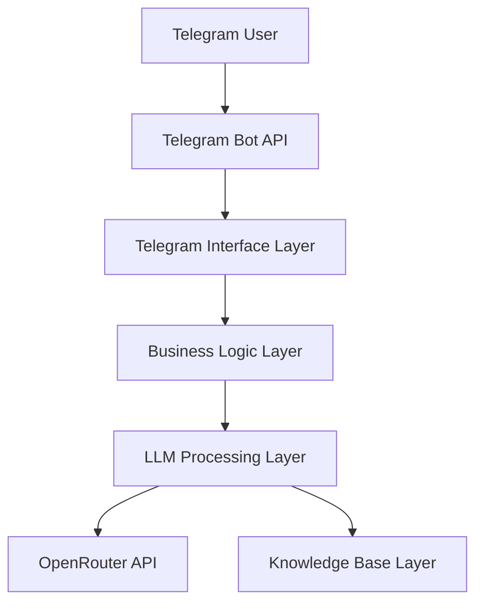

# Technical Vision - LLM Assistant Telegram Bot

## 1. Technologies

### Core Stack
- **Python**: 3.11+
- **Bot Framework**: aiogram (async Telegram bot framework)
- **LLM Integration**: OpenRouter API via OpenAI client
- **Dependency Management**: uv
- **Testing**: pytest
- **Automation**: make
- **Deployment**: Docker

### Key Dependencies
- `aiogram` - Telegram Bot API framework
- `openai` - OpenAI client library (for OpenRouter compatibility)
- `pytest` - Testing framework
- `python-dotenv` - Environment variables management

### Infrastructure
- **Data Storage**: In-memory structures (dict/list) - no database required
- **Configuration**: Environment variables + config files
- **Containerization**: Docker for deployment
- **Knowledge Base**: Embedded in system prompts

---

## 2. Development Principles

### KISS Approach
- **Minimalism**: Only necessary functionality, no over-engineering
- **Iterative Development**: Start with MVP, gradually add features
- **Fast Iterations**: Quick changes and testing capability

### Code Quality
- **Clean Code**: Clear naming, comments, documentation
- **Code Formatting**: Black for consistent formatting
- **Modular Structure**: Logical separation into components
- **Simple Error Handling**: Basic try/except blocks

### Configuration Management
- **Environment Variables**: All settings via .env file
- **No Complex Config**: Simple key-value pairs
- **Development Focus**: Easy local development setup

### Development Workflow
- **Sync Code**: No async/await unless absolutely necessary
- **Direct Implementation**: Straightforward logic without abstractions
- **Minimal Dependencies**: Only essential packages
- **Quick Feedback**: Fast testing and validation cycles

---

## 3. Project Structure

### Directory Organization
```
llmstart_project1/
├── src/
│   ├── bot/
│   │   ├── __init__.py
│   │   ├── handlers.py      # Telegram message handlers
│   │   ├── middleware.py    # Optional middleware
│   │   └── bot.py          # Bot initialization
│   ├── llm/
│   │   ├── __init__.py
│   │   ├── client.py       # OpenRouter client
│   │   └── prompts.py      # System prompts & knowledge base
│   ├── config.py           # Configuration management
│   └── main.py             # Application entry point
├── tests/                  # All tests flat structure
│   ├── test_bot.py
│   ├── test_llm.py
│   └── test_config.py
├── docs/
├── .env.example
├── .env                    # Local environment variables
├── requirements.txt        # Will be managed by uv
├── Dockerfile
├── Makefile                # Automation scripts
└── README.md
```

### File Naming Conventions
- **snake_case** for all Python files and directories
- **Descriptive names** reflecting functionality
- **Short but clear** module names

### Module Responsibilities
- `src/main.py`: Application entry point and startup
- `src/bot/`: Telegram bot logic and handlers
- `src/llm/`: LLM integration and knowledge base
- `src/config.py`: Environment and configuration management
- `tests/`: Flat structure with all test files

---

## 4. Project Architecture

### System Layers


### Architecture Components

#### 1. Telegram Interface Layer
- Handles incoming webhooks from Telegram
- Message parsing and validation
- Response formatting and sending
- Located in: `src/bot/handlers.py`

#### 2. Business Logic Layer
- Conversation flow management
- User state tracking (per chat_id)
- Decision making for response routing
- Located in: `src/bot/bot.py`

#### 3. LLM Processing Layer
- OpenRouter API integration
- Prompt construction and management
- Response processing
- Located in: `src/llm/client.py`

#### 4. Knowledge Base Layer
- Static company information
- Service descriptions and mappings
- System prompts
- Located in: `src/llm/prompts.py`

### Data Flow
1. **User Input**: Message received via Telegram API
2. **Parsing**: Extract text and chat_id
3. **State Check**: Retrieve conversation history for chat_id
4. **LLM Processing**: Send context + message to OpenRouter
5. **Response**: Return formatted response to user
6. **State Update**: Store message in conversation history

### State Management
- **In-Memory Storage**: Simple Python dictionaries
- **Key Structure**: `chat_id -> [message_history]`
- **No Persistence**: Data lost on restart (acceptable for MVP)

### Error Handling
- **Graceful Degradation**: Generic helpful message on LLM failure
- **Retry Logic**: 3 attempts with exponential backoff for API calls
- **User Notification**: Clear error messages without technical details
- **Fallback Responses**: Pre-defined responses for common scenarios
